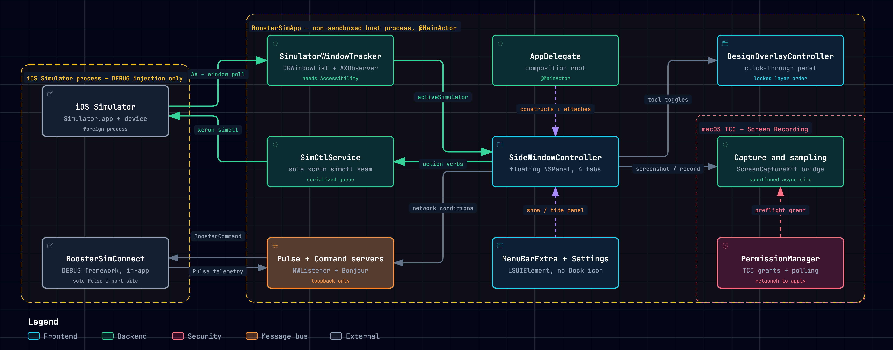

# BoosterSimApp

macOS menu bar companion app that attaches a floating side panel and design overlays to the iOS Simulator. Built with AppKit + SwiftUI. The app target links Apple frameworks only; the optional in-Simulator companion framework is the sole consumer of external packages.

## Architecture



The primary loop is *observe → present → act*: `SimulatorWindowTracker` watches the Simulator window, `SideWindowController` surfaces controls, and every mutation leaves through the single `SimCtlService` seam back into the Simulator.

- Interactive diagram (guided views, search, theme switch, export): [`docs/diagrams/boostersimapp-runtime.html`](docs/diagrams/boostersimapp-runtime.html)
- Vector version: [`docs/diagrams/boostersimapp-runtime.svg`](docs/diagrams/boostersimapp-runtime.svg)

## Features

**Core Panel**
- Bolt icon in menu bar — shows Simulator connection status
- Floating side panel attaches to active Simulator window
- Auto-positioning: left, right, bottom, or dynamic
- Collapse to 28pt strip; expand to 260pt panel
- Device header with simulator name and OS version
- Tab-based UI — 4 tabs (Capture, Design, Actions, Network) with icon-only floating header
- Preferences window (Cmd+,)

**Capture**
- Screenshots via ScreenCaptureKit with App Store Connect size presets and device-bezel framing
- Screen recording straight to disk (`SCStream` + `SCRecordingOutput`), with touch indicators toggled and restored
- Export to GIF, MP4, or MOV; route to file or clipboard
- Thumbnail flash panel after each capture

**Design Tools**
- Dual 8pt/4pt grid overlay, aligned and tracking through window move/resize
- Safe-area bands resolved from a device inset catalog, with manual override and reset
- Ruler with device-point readout
- Magnifier loupe and color picker with hex readout and copy
- Comparison artboard import via open, drag, or paste, with opacity control
- Single persistent click-through overlay panel with locked layer order (guides always above the artboard)

**App Actions**
- Reset app data, uninstall, clear keychain
- Send push notifications, open deep links
- Locale and timezone presets, simulated location, clipboard sync
- UserDefaults editor
- Environment Overrides — 11 accessibility toggles (appearance, contrast, motion, bold text, smart invert, reduce transparency, grayscale, on/off labels, button shapes, differentiate)

**Network**
- Traffic inspection with filtering, detail view, and cURL export
- Throttle profiles, airplane mode, and block rules
- Certificate Trust — generate CA, install/rotate/reset in the Simulator keychain
- Optional `BoosterSimConnect` framework loads into your DEBUG simulator build to capture traffic and enforce conditions in-process

**Built, not yet surfaced in the tabbed panel**

These services and views are implemented and tested, but are not currently reachable from the four panel tabs:

- Accessibility Inspector — live AX tree browsing with element highlighting
- Build Stats — recent build times chart from Xcode derived data
- Status Bar Control — 4 presets plus custom time/battery/signal
- Camera Toggle — use the Mac camera as Simulator input

**Onboarding**
- Permission onboarding (Accessibility, Screen Recording)
- Graceful fallback to 0.5s polling when Accessibility is denied

## Requirements

- macOS 26.2+ (`MACOSX_DEPLOYMENT_TARGET = 26.2`)
- Xcode 26.3 (macOS 26.2 SDK)
- iOS Simulator runtime (for live testing)

## Build & Run

```bash
cd BoosterSimApp
open BoosterSimApp.xcodeproj
# Press Cmd+R in Xcode
```

Or from terminal:

```bash
xcodebuild -project BoosterSimApp.xcodeproj -scheme BoosterSimApp -configuration Debug build
```

Run the unit suite (the UI-test bundle needs a booted Simulator and app launch):

```bash
xcodebuild -project BoosterSimApp.xcodeproj -scheme BoosterSimApp -destination 'platform=macOS' \
  test -only-testing:BoosterSimAppTests -skip-testing:BoosterSimAppUITests
```

## Permissions

On first launch, the onboarding flow guides you through:

| Permission | Purpose |
|---|---|
| Accessibility | Real-time window move/resize events via AXObserver; AX tree inspection |
| Screen Recording | Screenshots, screen recording, and overlay pixel sampling; reading Simulator device names from the window list |

Without Accessibility, the app falls back to 0.5s polling — still functional, less responsive. Screen Recording is preflighted before any capture; when it is denied, capture and color sampling degrade to an explanatory caption rather than failing silently. TCC grants apply only after relaunch, so the app surfaces a relaunch prompt.

The app is intentionally **not sandboxed** — Accessibility APIs, `CGWindowList`, `CFPreferences` writes into the Simulator domain, and `simctl` all require it.

## Dependencies

| Package | Version | Linked into |
|---|---|---|
| [Pulse](https://github.com/kean/Pulse) (`Pulse`, `PulseProxy`) | 5.2.2 | `BoosterSimApp` app target **and** `BoosterSimConnect` framework target |

Both targets declare `Pulse` and `PulseProxy` as package product dependencies (`project.pbxproj:199-202` and `:271-274`). The app target links them because its `fileSystemSynchronizedGroups` includes the `BoosterSimConnect/` folder, so it compiles those sources too. No file under `BoosterSimApp/` imports Pulse — the only `import Pulse` / `import PulseProxy` is in `BoosterSimConnect/BoosterSimConnect.swift`, behind `#if DEBUG && targetEnvironment(simulator)`, so the imports compile out of a macOS app build even though the products remain linked.

`BoosterSimConnect` is a DEBUG, simulator-only framework you load into your own app, so a release build of your app carries no cross-process surface.

## Architecture notes

SwiftUI `@main` App + `@NSApplicationDelegateAdaptor` for AppKit interop. `AppDelegate` is the single composition root — it constructs every service, panel, and controller with constructor injection; there is no service locator or DI framework. Services are `@MainActor final class … ObservableObject` and publish state over Combine; SwiftUI views are thin consumers. All placement math, coordinate mapping, image composition, and `simctl` argv construction lives in pure static helpers so it unit-tests without a device.

Four Xcode targets. `BoosterSimApp` is 128 Swift files (~16,075 LOC), `BoosterSimConnect` is 6 (~772 LOC), and the two test bundles are 28 files (~3,747 LOC).

```
BoosterSimAppApp (@main)
└── AppDelegate                     — composition root, wires everything
    ├── SimulatorWindowTracker      — CGWindowList poll + AXObserver
    │   ├── WindowEnumerator        — Quartz→AppKit window scan
    │   └── WindowObserver          — AXObserver per PID
    ├── SideWindowController        — NSPanel lifecycle + spring positioning
    │   ├── PositionCalculator      — pure frame math
    │   └── AXHighlightPanel        — AX element highlight overlay
    ├── DesignOverlayController     — overlay frame sync, capture-mode input
    │   ├── DesignOverlayService    — tool state + versioned persistence
    │   ├── SafeAreaCatalog         — pure device inset constants
    │   ├── OverlayGeometry         — pure window↔device-point mapping
    │   └── PixelSamplerService     — cached-capture pixel sampling
    ├── CaptureService              — screenshot/recording facade
    │   ├── ScreenshotService       — ScreenCaptureKit one-shot
    │   ├── RecordingService        — SCStream direct-to-disk
    │   ├── CaptureCompositor       — pure CG framing + render
    │   ├── CaptureExporter         — GIF/MP4/MOV export
    │   └── TouchIndicatorController— ShowSingleTouches snapshot/restore
    ├── AppActionService            — app reset, keychain, push, locale, location
    │   ├── DerivedDataAppScanner   — DerivedData .app discovery
    │   ├── UserDefaultsEditorService
    │   └── DeepLinkService
    ├── ConnectService              — network telemetry
    │   ├── PulseServer             — NWListener, _pulse._tcp. Bonjour
    │   └── PulsePacketDecoder      — framed zlib + JSON decode
    ├── NetworkConditionService     — airplane/throttle/block, single writer
    │   └── CommandServer           — loopback _booster-cmd._tcp. broadcast
    ├── CertificateService          — CA generation, install, rotate, reset
    │   └── CertificateStore        — CA persistence (0o600 restricted)
    ├── PermissionManager           — Accessibility / Screen Recording / DerivedData
    ├── SimCtlService               — the sole xcrun simctl executor
    ├── AppSettings                 — @AppStorage persistence
    ├── EnvironmentOverrideService  — 11 a11y toggles (instant, no relaunch)
    ├── StatusBarService            — status bar presets
    ├── BuildStatsService           — Xcode build history polling
    ├── AXInspectorService          — lazy AX tree walker
    └── CameraService               — Mac camera ↔ Simulator input

BoosterSimConnect.framework (DEBUG, in your simulator app)
├── BoosterSimConnect              — activate(), PulseProxy swizzle
├── BoosterNetworkProtocol         — URLProtocol condition enforcement
├── BoosterCommandClient           — command channel client
└── NetworkConditionController     — NSLock-guarded condition store
```

See [`docs/system-architecture.md`](docs/system-architecture.md) for full details.

## boostersim CLI

`booster-sim-cli/` is a separate SwiftPM executable package (11 Swift files, macOS 13+, `swift-argument-parser`) — "CLI tool for AI agents to control iOS Simulator". It is not part of the Xcode project and builds independently:

```bash
cd booster-sim-cli
swift build
swift run boostersim doctor
```

Commands: `doctor`, `list-devices`, `list-elements`, `screenshot`, `tap`, `press`, `swipe`, `type`.

## Keyboard Shortcuts

| Shortcut | Action |
|---|---|
| Cmd+B | Toggle side panel |
| Cmd+W | Hide side panel |
| Cmd+, | Open Preferences |

## Docs

| Document | Description |
|---|---|
| [`docs/diagrams/boostersimapp-runtime.html`](docs/diagrams/boostersimapp-runtime.html) | Interactive runtime architecture diagram |
| [`docs/project-overview-pdr.md`](docs/project-overview-pdr.md) | Product requirements |
| [`docs/system-architecture.md`](docs/system-architecture.md) | Architecture & data flow |
| [`docs/codebase-summary.md`](docs/codebase-summary.md) | File map & stats |
| [`docs/code-standards.md`](docs/code-standards.md) | Coding conventions |
| [`docs/design-guidelines.md`](docs/design-guidelines.md) | Design system |
| [`docs/project-roadmap.md`](docs/project-roadmap.md) | Feature roadmap |
| [`docs/deployment-guide.md`](docs/deployment-guide.md) | Build & distribution |
